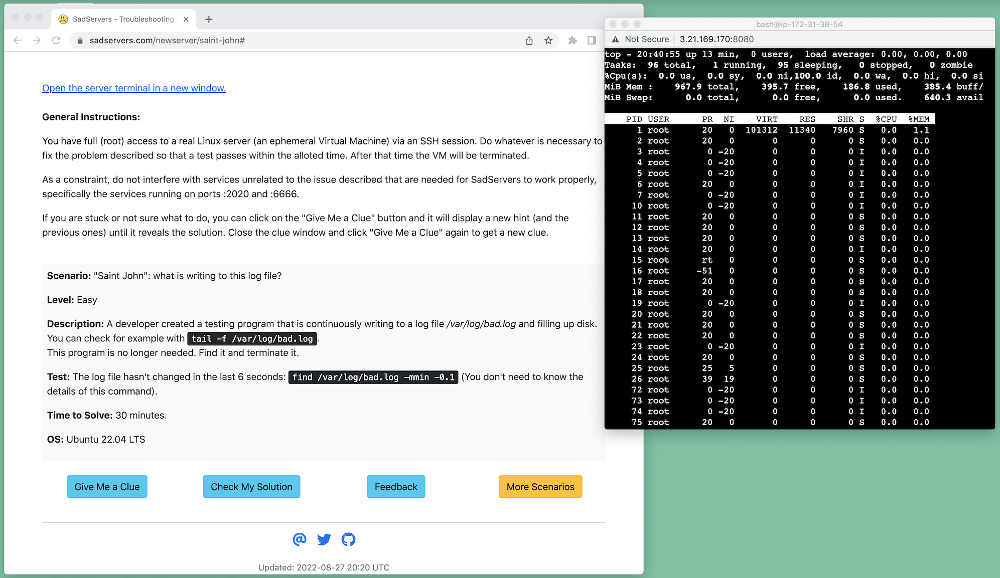
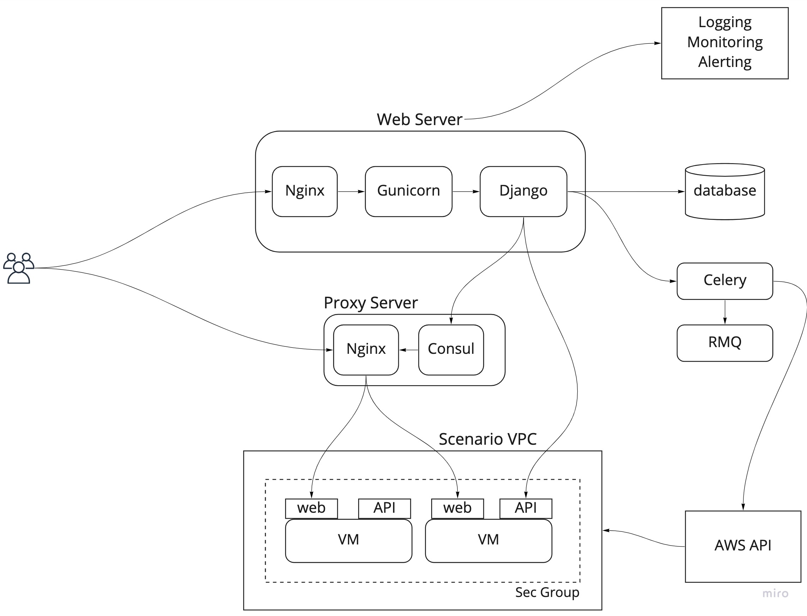

# SadServers

## What

[SadServers](https://sadservers.com/) is a SaaS where users can test their Linux troubleshooting skills on real Linux servers in a "Capture the Flag" fashion.  

There's a collection of scenarios, a description of what's wrong and a test to check if the issue has been solved. The servers are spun up on the spot, users get an "SSH" shell via a browser window to an ephemeral server (destroyed after the allotted time for solving the challenge) and then they can try and solve the problem.  

Problems include common software that run on Linux, like databases or web servers although knowledge of the details for the specific application is not necessarily required. It also includes scenarios where you do need to be familiar with the technology with the issue, for example, a Docker scenario. The scenarios are for the most part real-world ones, as in they are similar to issues that we have encountered.

SadServers is aimed primarily at users that are professional Software Developers (possibly), System Administrators, DevOps engineers, SREs, and related positions that require server debugging and troubleshooting skills.  

Particularly SadServers wants to test these professionals (or people aspiring to these jobs) in a way that would be useful for the purpose of a troubleshooting part of a job interview.

## Why

To scratch a personal itch and because there's nothing like this that I'm aware of. There are/were some sandbox solutions like Katacoda (shut down in May 2022) but nothing that gives you a specific problem with a condition of victory on a real server.  

It's also my not-so-secret hope that a sophisticated enough version of SadServers could be used by tech companies (or for companies that carry on job interviews on their behalf) to automate or facilitate the Linux troubleshooting interview section.  

An annoyance I found during my interviews is that sometimes instead of helping, the interviewer unintentionally misleads you, or you feel like you are in a tv game where you have to maximize for some arbitrary points and come up with an game strategy that doesn't reflect real incident situations (do I try to keep solving this problem or do I move to the next one, which one is better?).

## How does it look?

## Architecture

See diagram:

Users interact via HTTPS only with a web server and a proxy server connecting to the scenario VMs. The rest of the communications are internal between VPCs or AWS services. Each scenario VM resides in a VPC with no Internet-facing incoming access and limited egress access.

### Web server

The website is powered by [Django](https://www.djangoproject.com/) and Python3, with [Bootstrap](https://getbootstrap.com/) and plain Javascript at the front.  

In front of Django there's an [Nginx](https://www.nginx.com/) server and [Gunicorn](https://gunicorn.org/) WSGI server. The SSL certificate is generously provided by [Let's Encrypt](https://letsencrypt.org/) and its certbot, the best thing to happen to the Internet since Mosaic.

### Task Queue

New server requests are queued and processed in the background. On the front-end I'm using [Celery Progress Bar for Django](https://github.com/czue/celery-progress). The tasks are managed asynchronously by [Celery](https://docs.celeryq.dev/en/stable/) with a [RabbitMQ](https://www.rabbitmq.com/) back-end and with task results saved to the main database (and yes, maybe there should be a simpler but still robust stack instead of this).  

Instances are requested on AWS using [Boto3](https://github.com/boto/boto3), based on scenario images. A Celery beat scheduler checks for expired instances and kills them. 

### Permanent Storage

A [PostgreSQL](https://www.postgresql.org/) database is the permanent storage backend, the first choice for RDBMS. [SQLite](https://www.sqlite.org/index.html) is a valid alternative for sites without a high rate of (concurrent) writes.  
 
### Proxy Server

In the initial proof of concept, I had the users connect to the VMs public IP directly. For security reasons like terminating SSL, being able to use rate limiting, logging access and specially having the VMs with private IPs only, it's a good idea to route access to the scenario instances through a reverse web proxy server.  

Since the scenario instances are created on demand (at least some of them), I needed a way to dynamically inject in the web server configuration the route mappings, ie, using code against an API to configure the web server and reloading it. The configuration for proxying a VM would be like proxy.sadservers.com:port/somestring -> (proxy passes to upstream server) -> VM ip address:port .  (Using a path string is an option, other options could be passing a ...?parameter in the URL or in the HTTP headers). 

This was an interesting learning experience since unlike the rest of the stack I've never had this situation before. After considering some alternatives, I almost made it work with [Traefik](https://doc.traefik.io/traefik/) but I hit a wall, and at the end it didn't seem to be a good solution for this case.  A friend of mine suggested to use [Hashicorp Consul](https://www.consul.io/), where the Django server connects to and writes to its key/value store, and [Consul-template](https://github.com/hashicorp/consul-template), which monitors Consul and writes the key/values (string and IP) into the Nginx configuration (which does the actual SSL and proxying) and reloads it. After figuring out production settings (certificates, tokens) it turned out to work very well.

### Scenario Instances

On the VM instances, [Gotty](https://github.com/yudai/gotty) provides a terminal with a shell as HTTP(S). An agent built with Golang and [Gin](https://github.com/gin-gonic/gin) provides a rest API to the main server, so solutions can be checked and commands can be sent to the scenario instance or data extracted from it.

### Other Infrastructure & Services

Without a lot of detail, there's quite a bit of auxiliary services needed to run a public service in a decent "production-ready" state. This includes notification services (AWS SES for email for example), logging service, external uptime monitoring service, scheduled backups, error logging (like [Sentry](https://sentry.io/)), infrastructure as code (Hashicorp [Terraform](https://www.terraform.io/) and [Packer](https://www.packer.io/)).

## Site Priorities

There are two main objectives: 1) to provide a good user experience with value and 2) security.

### User Experience

Not a UX expert as anyone can see but just trying to make it as simple and less confusing as possible. Like Seth Godin says in _The Big Red Fez_, "show me the banana" (make evident where to click). The "happy paths" are so far one or two clicks away.

### Security

Security starts with _threat modeling_, which is a fancy way of saying "think what can go terribly wrong and what's most likely to go wrong". (Sidebar: Infosec is full of these big fancy expressions like "blast radius", "attack vector", "attack surface" or my favourite one "non-zero"; except if ending the sentence you can just omit it, try it with "there's a non-zero chance of blah").  

For this project I see two types issues that adversarial ("bad hacker") agents could possibly inflict, focusing first on financial incentives and then on assholery ones:  
- Monetary-based: there are free computing resources, so they could try and use for things like mining crypto or as a platform to launch malware or spam attacks (at an ISP I worked for, frequently a VM maxing out CPU was a compromised one sending spam or malware).
- Monetary-based: AWS account credentials need to be managed for the queuing service that calls the AWS API. If these credentials are compromised, then I could be stuck with a big AWS bill.
- Nastiness-based: general attacks like DoS on public endpoints from the outside or internal or "sibling" attacks from scenario VMs to other VMs. 

**Mitigation**

An incomplete list of things to do in general or that I've done in this case:
- (Principle of least privilege) create a cloud account with permissions just to perform what you need. In my case, to be able to only create ec2 nodes, of a specific type(s) in specific subnets. Given the type of instance (nano, also using "spot" ones) and size of subnet(s) and therefore VMs, there's a known cap on the maximum expense that this account could incur during a period of time.
- Monitor all the things and alert. Budgets and threshold alerts in your cloud provider are a way to detect anomaly costs.
- Access and application logs are also helpful in detecting malicious behaviour. 
- In my case, instances spun normally from the website are garbage-collected after 15-45 minutes and are not powerful, so it's a disincentive for running malicious or opportunistic programs on them.
- Scenario VMs are isolated within their VPC. The only ingress network traffic allowed is from the web server to the agent and from the proxy server to the shell-to-web tool. The only egress traffic allowed is ICMP and indirectly (via a local name server), DNS. This eliminates in principle the risk of these instances being used to launch attacks on other servers in the Internet.
- From the outside Internet there's only network access to an HTTPS port on both web server and proxy server, also there are automatic rate-limiting measures at these public entry points.

## Code

This project may become Open Source at some point but for now the code is not publicly available. One reason is that showing the solution to the scenarios defeats the purpose and another reason is to expose details of how things are set up for security reasons. I'll be happy to chat about technical aspects of the project if someone is curious.

## Issues

- Opening a new scenario while one is ongoing will invalidate the session of the first one. Clues are based on sessions so the clues displayed will be that of the latest session, which will be incorrect for previous scenarios.  

## Roadmap

- Multi-VM scenarios (troubleshooting Kubernetes for example).
- Save & replay user command history.
- OS package repository cache/proxy server.

## Contact

Any feedback is appreciated, please email info@sadservers.com

## Collaboration

If you want to create a scenario, these are broadly the requirements:  

- A clear (not ambiguous) problem statement, ideally one that can be shown with a command or combination of commands.  
- Even more importantly, a clear pass/fail test for the user that they can run in the form of a command or commands and therefore it can be checked with a Bash script, i. e., if we run a check.sh script, it will always return a binary result (strings "OK" and "NO" for example). 
- Furthermore, the check.sh script is accessible by the user (they can actually run it to verify their work), so the solution should not be given away in this script. For example, if the problem is about a process that needs to be killed, if we check in the script by testing for example `ps au|grep rogue`, then we are revealing the name of the process.
- For scenarios where a good check script is not possible, there's an option in the system to just not use the "Check solution" option for a scenario.
- A description of one solution to the problem, favoring simple and "production" ones.  
- An automated way to create the problem. This is, a script and other files that will set up the problem fully on a non-licenced Linux distribution available in AWS (for example, latest Debian or Ubuntu). For instance, if the scenario issue is about a broken web server configuration, the script would install the web server and replace the original config file with the problematic one. An Ansible playbook or Hashicorp Packer template and auxiliary files would be ideal. See examples in [scenarios](scenarios).
- Optionally, a set of clues or tips that will increasingly get the user closer to the solution.  
- Other:
    - I'm using ports :8080 and :6767 for the shell-to-web and agent, so don't try and run services on those ports.
    - Currently only supporting one VM scenarios and not multiple VM scenarios.
    - VMs should be fully self-contained and not need the Internet for anything, ie, the user wouldn't need to initiate connections from the scenario VM to the Internet save for ICMP (ping) and DNS traffic. A possible exception would be access to an OS package repository proxy. 

## Scenarios

[Scenarios](scenarios)
