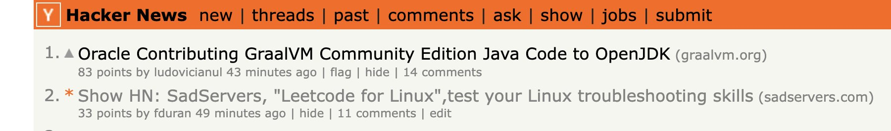
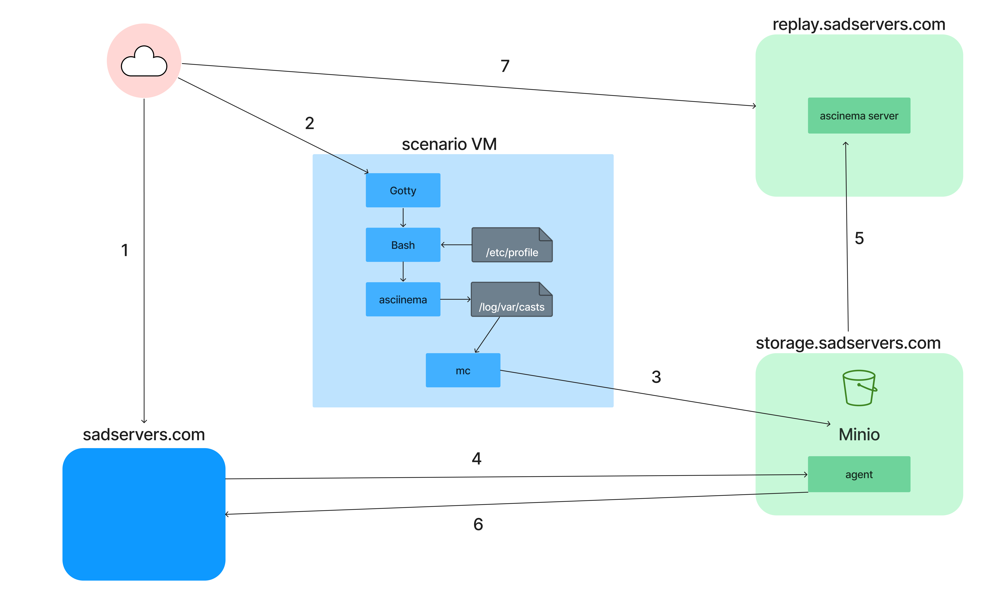
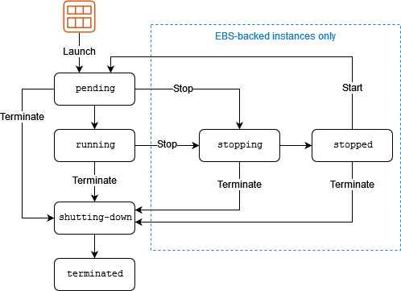
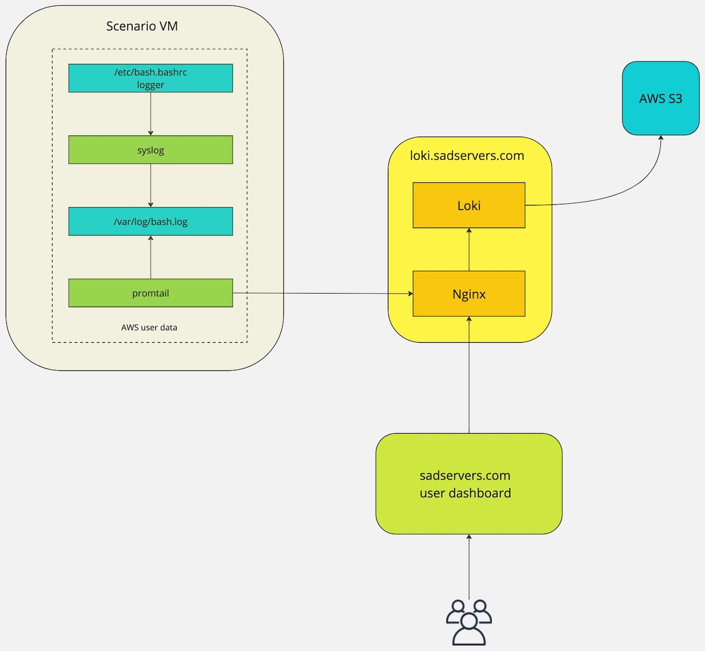
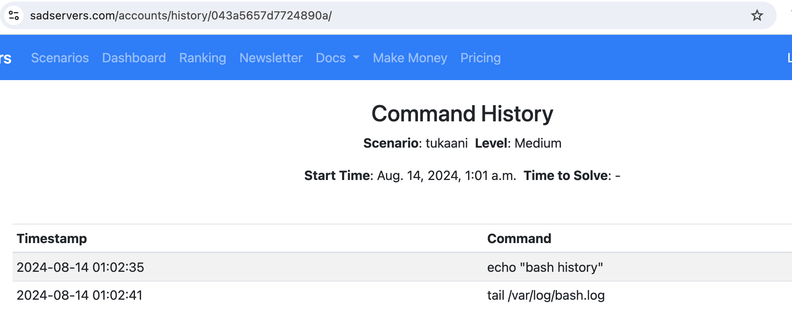

# SadServers

[SadServers](https://sadservers.com/) is a SaaS where users can test their Linux and DevOps troubleshooting skills on real Linux servers in a "Capture the Flag" fashion.

[](mailto:info@sadservers.com)&nbsp;&nbsp;&nbsp;
[](https://twitter.com/sadservers_com)&nbsp;&nbsp;&nbsp;
[](https://mastodon.social/@sadservers)&nbsp;&nbsp;&nbsp;
[](https://stats.uptimerobot.com/ZRGoBu7Kp9) 

[Make Money Creating SadServers Scenarios](https://docs.sadservers.com/docs/make-money-creating-scenarios/)

**Table of Contents:**  

- [What](#what)
- [Why](#why)
- [When](#when)
- [How Does It Look](#how-does-it-look)
- [Architecture](#architecture)
    - [Web Server](#web-server)
    - [Task Queue](#task-queue)
    - [Permanent Storage: SQLite](#permanent-storage-sqlite)
    - [Scenario Instances](#scenario-instances)
    - [Replay System](#replay-system)
    - [Resumable VMs](#resumable-vms)
    - [API](#api)
    - [Scenario Command History Logging](#scenario-command-history-logging)
    - [Other Infrastructure Services](#other-infrastructure--services)
- [Other Development Practices](#other-development-practices)
    - [Feature Flags](#feature-flags)
    - [Linting](#linting)
    - [Functions and Comments](#functions-and-comments)
    - [Automated Testing](#automated-testing)
- [Site Priorities](#site-priorities)
    - [User Experience](#user-experience)
    - [Security](#security)
- [Code](#code)
- [Issues](#issues)
- [Roadmap](#roadmap)
- [Collaboration](#collaboration)
- [Scenarios](#scenarios)
- [Contact](#contact)


## What

[SadServers](https://sadservers.com/) is a SaaS where users can test their Linux (Docker, Kubernetes...) troubleshooting skills on real Linux servers in a "Capture the Flag" fashion.  

There's a collection of scenarios, a description of what's wrong and a test to check if the issue has been solved. The servers are spun up on the spot, users get an "SSH" shell via a browser window to an ephemeral server (destroyed after the allotted time for solving the challenge) and then they can try and solve the problem.  

Problems include common software that run on Linux, like databases or web servers although knowledge of the details for the specific application is not necessarily required. It also includes scenarios where you do need to be familiar with the technology with the issue, for example, a Docker scenario. The scenarios are for the most part real-world ones, as in they are similar to issues that we have encountered.

SadServers is aimed primarily at users that are professional Software Developers (possibly), System Administrators, DevOps engineers, SREs, and related positions that require server debugging and troubleshooting skills.  

Particularly SadServers wants to test these professionals (or people aspiring to these jobs) in a way that would be useful for the purpose of a troubleshooting part of a job interview.

## Why

To scratch a personal itch and because there's nothing like this that I'm aware of. There are/were some sandbox solutions like Katacoda (shut down in May 2022) but nothing that gives you a specific problem with a condition of victory on a real server.  

It's also my not-so-secret hope that a sophisticated enough version of SadServers could be used by tech companies (or for companies that carry on job interviews on their behalf) to automate or facilitate the Linux troubleshooting interview section.  

An annoyance I found during my interviews is that sometimes instead of helping, the interviewer unintentionally misleads you, or you feel like you are in a tv game where you have to maximize for some arbitrary points and come up with an game strategy that doesn't reflect real incident situations (do I try to keep solving this problem or do I move to the next one, which one is better?).


## When

SadServers was "launched" in [Hacker News in October 2022](https://news.ycombinator.com/item?id=33344142), reaching the #2 position that day and yes, it suffered from the ["HN hug of death"](https://medium.com/devops-dev/sadservers-and-the-hacker-news-hug-of-death-a-postmortem-af20ddc58526).



## How does it look?


## Architecture

See diagram:


Users interact via HTTPS only with a web server and a proxy server connecting to the scenario VMs. The rest of the communications are internal between VPCs or AWS services. Each scenario VM resides in a VPC with no Internet-facing incoming access and limited egress access.

### Web server

The website is powered by [Django](https://www.djangoproject.com/) and Python3, with [Bootstrap](https://getbootstrap.com/) and plain Javascript at the front.  

In front of Django there's an [Nginx](https://www.nginx.com/) server and [Gunicorn](https://gunicorn.org/) WSGI server. The SSL certificate is generously provided by [Let's Encrypt](https://letsencrypt.org/) and its certbot, the best thing to happen to the Internet since Mosaic.

### Task Queue

New server requests are queued and processed in the background. On the front-end I'm using [Celery Progress Bar for Django](https://github.com/czue/celery-progress). The tasks are managed asynchronously by [Celery](https://docs.celeryq.dev/en/stable/) with a [RabbitMQ](https://www.rabbitmq.com/) back-end and with task results saved to the main database (and yes, maybe there should be a simpler but still robust stack instead of this).  

Instances are requested on AWS using [Boto3](https://github.com/boto/boto3), based on scenario images. A Celery beat scheduler checks for expired instances and kills them. 

### Permanent Storage: SQLite

[SQLite](https://www.sqlite.org/index.html) is the database currently used in SadServers.

What makes SQLite a good choice? Basically it's fast, solid, cheap and easy to manage. The criteria I'd have for using SQLite would be:  
- The application is not so write-heavy that you get SQlite **lock errors** ()"SQLITE_BUSY").
- The **cost** of the project or projects that depend on SQLite is less than a few thousand dollars. The reasoning here is that a managed PostgreSQL (or MySQL) database, say AWS RDS with "High Availability" (two zones, PITR) runs in the hundreds of dollars.
- **Data and uptime criticality**: you are fine with the downtime and possible loss of data caused by not having automatic database fail-over and recovery; you'll recover quickly by simply copying over a backup file. Note that if you are doing frequent SQlite copies (or better yet, continuously stream to a copy) then you are almost sure guaranteed that you'll have your data back and the database up and running (except for the gap of time since the database or server incident and recovery). Due to their complexity and failure modes, regular database systems may be hard to recover and it may take a long time to recover (ingesting a lot of backed-up WALs for example).

Otherwise, the [PostgreSQL](https://www.postgresql.org/) database is a good default first choice for RDBMS (and can be considered for JSON data for example), everything else being equal (eg, if you are more familiar with MySQL, go with MySQL).

A couple of notes:
- I had some SQLite lock errors but they went away after using `PRAGMA journal_mode = WAL`. There are other "PRAGMA" Sqlite settings that help with locking, like using a longer `PRAGMA busy_timeout`.
- For backing up SQlite, even if it's a file, you don't want to use the OS file copy command since this can lead to corruption; instead use SQlite `.backup` command, for ex: `sqlite3 db.sqlite3 ".backup 'db.backup.sqlite3'"`.  
For continuous backup, you can use [Litestream](https://litestream.io/). By streaming a copy of SQLite offsite, you are getting an availability that is reduced only to the time of being alerted and downloading the latest copy from the cloud into your (perhaps new) server. The data lost is also reduced to the minimum.

I've seen the argument that SQLite is a good local development option but this is backwards; if you have Postgres (or Mysql or whatever) in production, you want to use the same database and version (and be able to change versions easily), and this is easily achieved with just one docker command (for ex `docker run --name some-postgres -e POSTGRES_PASSWORD=mysecretpassword -d postgres:16.3`).
 
### Proxy Server

In the initial proof of concept, I had the users connect to the VMs public IP directly. For security reasons like terminating SSL, being able to use rate limiting, logging access and specially having the VMs with private IPs only, it's a good idea to route access to the scenario instances through a reverse web proxy server.  

Since the scenario instances are created on demand (at least some of them), I needed a way to dynamically inject in the web server configuration the route mappings, ie, using code against an API to configure the web server and reloading it. The configuration for proxying a VM would be like proxy.sadservers.com:port/somestring -> (proxy passes to upstream server) -> VM ip address:port .  (Using a path string is an option, other options could be passing a ...?parameter in the URL or in the HTTP headers). 

This was an interesting learning experience since unlike the rest of the stack I've never had this situation before. After considering some alternatives, I almost made it work with [Traefik](https://doc.traefik.io/traefik/) but I hit a wall, and at the end it didn't seem to be a good solution for this case.  A friend of mine suggested to use [Hashicorp Consul](https://www.consul.io/), where the Django server connects to and writes to its key/value store, and [Consul-template](https://github.com/hashicorp/consul-template), which monitors Consul and writes the key/values (string and IP) into the Nginx configuration (which does the actual SSL and proxying) and reloads it. After figuring out production settings (certificates, tokens) it turned out to work very well.

### Scenario Instances

On the VM instances, [Gotty](https://github.com/yudai/gotty) provides a terminal with a shell as HTTP(S). An agent built with Golang and [Gin](https://github.com/gin-gonic/gin) provides a rest API to the main server, so solutions can be checked and commands can be sent to the scenario instance or data extracted from it.

### Replay System

For the [Linux World Cup](https://github.com/fduran/linuxworldcup) I wanted to have a way to record the user command line sessions and be able to show them publicly. I mean, what good is a World Cup or any competition if people cannot see what the participants are doing?  

I looked at several options and ended up implementing [asciinema](https://asciinema.org/) which does the heavy lifting. You can see the results at [https://replay.sadservers.com](https://replay.sadservers.com).  

Asciinema supports AWS S3 as a backend storage, but I decided that a better option for my case is to have S3 in front of the asciinema server, in part due to security and also because it gives me more control. The implementation of this "S3" is done with [Minio](https://min.io/) in a self-hosted server.

Diagram:



The workflow is as follows:

1. The user (cloud icon) goes to SadServers.com and creates an AWS instance VM.
2. The VM offers a shell-like web interface using Gotty (traffic goes through a proxy not shown here). Gotty calls Bash as login, which calls `/etc/profile` and in there I call `asciinema record` to a file (with a conditional test so it doesn't create an infinite loop).
3. A Minio client `mc` periodically ships the cast file (up to a size) to the Minio storage server (Minio has an `mc mirror` option to constantly sync file changes but it didn't work for me). If the user does a shutdown, using `systemd` I'm able to synchronize the last command changes and send them. There's also a maximum file size limit in the storage server.
4. When the VM is destroyed, the web server sends a request to the storage server, where an agent I wrote:
5. uploads the cast file to the asciinema server (replay server) and 
6. returns the URL in the replay server to the web server so it's saved to the database and shown in the user's dashboard as a link to the replay server for the scenario they tried.
7. The user (or anyone, it's public) can see their session replay.

In the call to the agent (step 4), I can decide via a database flag for the scenario if I want to upload the screencast from the storage server to the public replay server. This allows me the control to decide if some scenarios have their sessions made public or not, while still retaining in the storage server all the casts.

This feature was used in the Linux World Cup for example, where I wanted to show everyone how people solved (or tried to solve) the challenges but I didn't want the sessions to be public until the event was over.

### Resumable VMs

For users that are doing guided learning at their own pace (rather than solving a "challenge"), like for example the [Linux Upskill Challenge](https://linuxupskillchallenge.org/) ,  SadServers offers "resumable" VMs, ie, servers that the user can stop and restart without losing their changes.  

Currently this feature is limited to one VM per (registered) user. Also, these VMs can be destroyed after a number of days of inactivity or after a total number of days.  

From the user's point of view, the lifecycle of their resumable instance follows the same lifecycle as any (EBS-backed, not spot) instance in AWS (shown below), with the difference that the transitions states are not shown to the user. So the instance can be either Running or Stopped, and from either one of those two states it can be Terminated.  

Once the resumable instance is terminated, the user can choose to create another one.



### API

SadServers offers an API, built with the [Django REST framework](https://www.django-rest-framework.org/) and with a web interface at [https://sadservers.com/api/](https://sadservers.com/api/).

See the full [API Documentation](https://docs.sadservers.com/docs/api/).

### Scenario Command History Logging

For certain scenario instances, there's the capability of logging the user shell command history and displaying this command history in the user's dashboard.

This is currently enabled for Pro accounts only and logs are stored for 30 days (any of that can change). The feature is still in "beta" mode with no SLOs.

The main ideas for the implementation can be seen in the diagram below. The workflow is:  

  - Upon shell login, `/etc/bash.bashrc` file is executed, where we use the `logger` command to log the last command in the shell history to the system syslog facility.
  - syslog writes to a `/var/log/bash.log` file
  - [Grafana Promtail](https://grafana.com/docs/loki/latest/send-data/promtail/) watches that log file and ships new lines to a [Grafana Loki](https://grafana.com/oss/loki/) server with a label for the instance ID.
  - The user dashboard at the SadServers.com website queries the Loki server for logs in instances belonging to the user.  



**Details**

The ElasticSearch stack "ELK", with a log shipper like `fluent bit` is another back-end option, but I have PTSD from managing in the past a large ElasticSearch install and don't want to spend a lot of time managing it. Loki is much simpler and takes up way less storage space.

In the `/etc/bash.bashrc` file I'm using this code:

```
HISTFILESIZE=10000
shopt -s histappend

myhistory() { history 1 | awk '{ \$1=""; print}'; return \$?; }
export PROMPT_COMMAND='logger -p local6.debug "\$(myhistory)"'
```

This code avoids sending duplicate back-to-back commands in the history (I have conflicting feelings about this), then it returns the last command in the shell `history` and uses Bash built-in `PROMPT_COMMAND` as a way to send that command text to a syslog facility via `logger`, which also adds a timestamp and user name.  

Syslog sends that command text line to a `/var/log/bash.log` file and Promtail does some parsing and labeling and continuously ships the contents of that log file to the Loki server (which is not exposed to the Internet and fronted by an Nginx server for access and rate control). The logs of the instance are identified by the AWS instance id.  

When a logged-in user goes to their SadServers dashboard, there's code that goes to the Loki API endpoint and queries it for logs belonging to instances that the user created in the last 30 days.

All the changes needed in the scenario VM so it ships command history logs are not saved in the VM AMI, as in I'd have to re-do all the scenarios AMIs at least once (and again any time I make any change). Instead, all this changes are dynamically inserted at boot time via [AWS user data](https://docs.aws.amazon.com/AWSEC2/latest/UserGuide/user-data.html) via a shell script.  

As an issue, the replay asciinema implementation interferes with this history logging system, as in for VMs with the replay implementation, the commands are only logged once you do another shell login like "sudo su".

The UX at the moment:  

Dashboard:  
 

Instance command history:
  

### Other Infrastructure & Services

Without a lot of detail, there's quite a bit of auxiliary services needed to run a public service in a decent "production-ready" state. This includes notification services (AWS SES for email for example), logging service, external uptime monitoring service, scheduled backups, error logging (like [Sentry](https://sentry.io/)), infrastructure as code (Hashicorp [Terraform](https://www.terraform.io/) and [Packer](https://www.packer.io/)).

## Other Development Practices

### Feature Flags

A feature flag or toggle is the ability to be able to turn off or on a piece of software code. In its fancy variation it can also allow for a percentage of the code execution to enter the gated code, this would be an implementation of "canary" releases.  

There's even a couple feature flags SaaS companies (I mean there's a SaaS for almost everything so why not) but I found them very expensive.

Some say feature flags allow for the separation of deployments (code in prod) and releases (code executed in prod). This sounds very good but if you are not testing the feature-flagged code then what's really the difference between the code being there and not executed and the code living in some Git branch? I think without testing it only gives you some basic linter-level asurances (like libraries are installed, variables not duplicated) and the great advantage of not having to merge a big branch into main.

I've used feature flags (without canary) for big changes like turning on Stripe payments, and they all worked great. In Django to feature-flag the templates and urls is not easy if you try to do directly in their code or in the views but it's easy to do using Django's middleware.

### Linting

I use `Flake8` as linter and fix (almost) all the flagged issues so there's no warnings. The default Python PEP 8 line length of 79 characters is ridiculous even when working on a small screen, so I'm using it with `--max-line-lenght=100`, which is still pretty short (goes up to half the page in Github for example). I've also used `Pylint` in other projects and I don't remember any significant difference between the two.  

Ideally you want to run the linting automatically in your CI/CD chain as soon as you commit your code.

### Functions and Comments

I group functions that deal with different topics in separate files; if I'm scrolling more than a few "pages" long on my screen that's a sign I should start thinking about breaking up the file.  

Functions should be short and doing mostly one thing. That said, and against one famous book author, breaking up all functions when they reach a few lines of code (did he say five or so!?) makes no sense to me. I have a lot of small "auxiliary" functions and I do have a couple long ones with the basic workflow, so I can follow in one place most of the logic. Breaking one of those would result in a lot of duplication, passing the same things back and forth and jumping around reading back and forth to follow the code path. I optimize code for (humans) reading.

The "don't write comments; code should speak for itself" crowd, well, I don't know where they've worked that they had such self-describing code but even with ideal code, it cannot explain the **why**. Adding context with the reasons why and explaining tricky code are two damn good reasons to write comments. Basically everything you'd forget a few months from now or that somebody coming to the project may ask about, write about.

I wouldn't mind writing type hints for Python functions but I'm not sure it would have caught any issues.

### Automated Testing

I confess I don't do TDD :-|

The most valuable tests for me, in this project, are end-to-end tests. I use two types of automated tests:  

- Code sanity check: it's `pytest` running in Github Actions whenever I push code, which calls [playwright](https://playwright.dev/) pretending to be a browser and it does some basic site navigation. This is a simple smoke test making sure there are no big issues in the Django project, and it has already saved me from things like a typo in a config file breaking everything.  
- End-to-end full path check. Every x minutes I run a "happy path" test from outside the production environment using the SadServers API, reproducing all the server-side part of what a user does when they create a new scenario VM. This test runs the main code "normal" path and uses all real dependencies (database, AWS etc) so it will catch any big internal or dependencies issues. I think this is the best "bang for the buck" test one can do in a SaaS.

## Site Priorities

There are two main objectives: 1) to provide a good user experience with value and 2) security.

### User Experience

Not a UX expert as anyone can see but just trying to make it as simple and less confusing as possible. Like Seth Godin says in _The Big Red Fez_, "show me the banana" (make evident where to click). The "happy paths" are so far one or two clicks away.

### Security

Security starts with _threat modeling_, which is a fancy way of saying "think what can go terribly wrong and what's most likely to go wrong". (Sidebar: Infosec is full of these big fancy expressions like "blast radius", "attack vector", "attack surface" or my favourite one "non-zero"; except if ending the sentence you can just omit it, try it with "there's a non-zero chance of blah").  

For this project I see two types issues that adversarial ("bad hacker") agents could possibly inflict, focusing first on financial incentives and then on assholery ones:  
- Monetary-based: there are free computing resources, so they could try and use for things like mining crypto or as a platform to launch malware or spam attacks (at an ISP I worked for, frequently a VM maxing out CPU was a compromised one sending spam or malware).
- Monetary-based: AWS account credentials need to be managed for the queuing service that calls the AWS API. If these credentials are compromised, then I could be stuck with a big AWS bill.
- Nastiness-based: general attacks like DoS on public endpoints from the outside or internal or "sibling" attacks from scenario VMs to other VMs. 

**Mitigation**

An incomplete list of things to do in general or that I've done in this case:
- (Principle of least privilege) create a cloud account with permissions just to perform what you need. In my case, to be able to only create ec2 nodes, of a specific type(s) in specific subnets. Given the type of instance (nano, also using "spot" ones) and size of subnet(s) and therefore VMs, there's a known cap on the maximum expense that this account could incur during a period of time.
- Monitor all the things and alert. Budgets and threshold alerts in your cloud provider are a way to detect anomaly costs.
- Access and application logs are also helpful in detecting malicious behaviour. 
- In my case, instances spun normally from the website are garbage-collected after 15-45 minutes and are not powerful, so it's a disincentive for running malicious or opportunistic programs on them.
- Scenario VMs are isolated within their VPC. The only ingress network traffic allowed is from the web server to the agent and from the proxy server to the shell-to-web tool. The only egress traffic allowed is ICMP and indirectly (via a local name server), DNS. This eliminates in principle the risk of these instances being used to launch attacks on other servers in the Internet.
- From the outside Internet there's only network access to an HTTPS port on both web server and proxy server, also there are automatic rate-limiting measures at these public entry points.


## Code

This project may become Open Source at some point but for now the code is not publicly available. One reason is that showing the solution to the scenarios defeats the purpose and another reason is to expose details of how things are set up for security reasons. I'll be happy to chat about technical aspects of the project if someone is curious.

## Issues

See [Issues](https://github.com/fduran/sadservers/issues)

## Roadmap

- ~~Save & replay user command history.~~ DONE (with some limitations like replay file size, see [Replay Server](https://replay.sadservers.com/) )
- ~~Instances with public IPs where the user's public SSH key is added so they can use any SSH client.~~ DONE for selected users. 
- ~~Code to run competitions~~ DONE for the <A href="https://linuxworldcup.com/">Linux World Cup</a>
- ~~Guided scenarios with stop-and-resume VMs.~~ DONE
- ~~User comment system.~~ DONE [piggy-backing on Github](https://github.com/fduran/sadservers/discussions)
- ~~Add tags to scenarios~~ DONE
- ~~Blog or article system.~~ [DONE](https://docs.sadservers.com/) 
- ~~API~~ [DONE](https://docs.sadservers.com/docs/api/)
- Multi-VM scenarios.
- OS package repository cache/proxy server.
- A system for users to upload their scenarios.
- Downloadable scenario VMs (OVA).
- Translation of texts to multiple languages.
- Guided learning system.
- Login using Github or Gmail account.
- Look into WebAssembly (WASM) so users can run (some) scenarios in the browser.
- Look into alternative hosting methods:
    - Kubernetes for Dockerized scenarios.
    - <a href="https://firecracker-microvm.github.io/">Firecracker</a>.


## Collaboration

I'm not looking for web development (SadServers.com front-end and back-end) help at the moment. The biggest help I'll appreciate is:

- Feedback on the scenarios and general website user experience.
- Creation of scenarios.

Currently there's a pay-for-scenario bounty request; see the details at [Make Money Creating SadServers Scenarios](https://docs.sadservers.com/docs/make-money-creating-scenarios/).

## Scenarios

[Scenarios](scenarios)

## Contact

Any feedback is appreciated, please email info@sadservers.com
